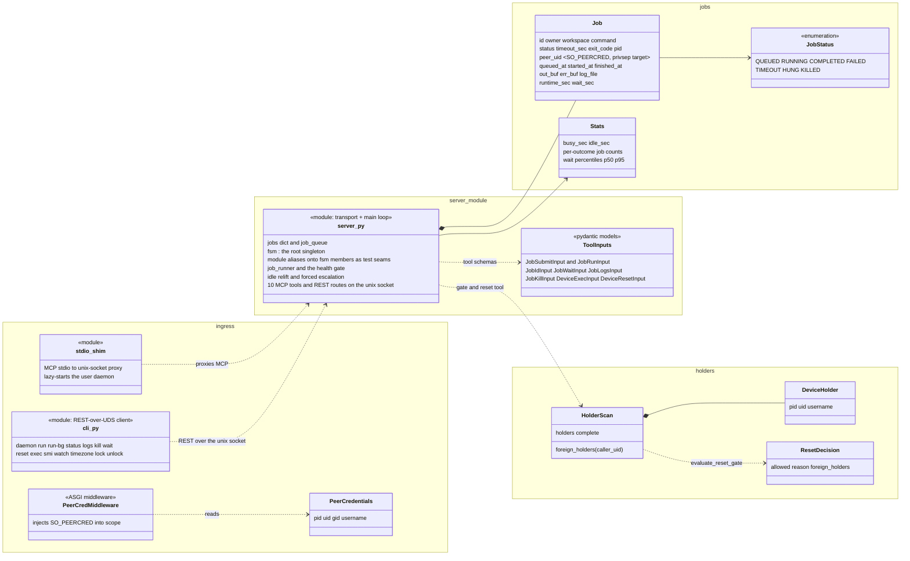

<!--
SPDX-FileCopyrightText: © 2026 Tenstorrent USA, Inc.

SPDX-License-Identifier: Apache-2.0
-->

# Overview

Scope: the system map — what the broker is, the component boundaries the numbered specs are cut
along, the end-to-end data flow, and the glossary. Normative detail lives in specs 01–09; this
spec owns the shape.

## Purpose

tt-device-mcp is an MCP server that lets multiple Claude Code agents and developers safely share
one Tenstorrent device. Without it, concurrent test execution collides on the device and hangs
it. The core principle: **serialize all device access through a job queue — one job at a time** —
and never dispatch onto a mesh the broker cannot prove fit.

Two deployment shapes serve opposite hosts (spec 08): the **system broker** (root, systemd,
multi-tenant arbiter, health-gated, recovery-armed) on shared machines, and the **per-user
daemon** (no sudo, health-gated, ladder capped to what it can execute) on a single-user box or
in a container —
one card, one arbiter, never two.

## Component map

| Spec | Subsystem | Owns |
|---|---|---|
| [01-jobs](01-jobs.md) | Jobs | Queue, runner, lifecycle, timeouts, env resolution, process-group cleanup, re-adoption |
| [02-transports](02-transports.md) | Transports | Unix-socket MCP + stdio shim, REST surface, tool inventory; HTTP/TCP (Target: remove) |
| [03-health](03-health.md) | Health | ServerFsm root, HealthMonitor + probes, TelemetrySampler, the between-job gate, holds & relift |
| [04-recovery](04-recovery.md) | Recovery | Escalation ladder, platform policy vs shared mechanism, reset stages, cooldowns, ledgers, reset gate |
| [05-security](05-security.md) | Security | SO_PEERCRED identity, privsep, owner authz, exec gating, the bare-metal lock |
| [06-state-paths](06-state-paths.md) | State & config | Every durable path × both shapes, install/runtime base split, the env-var index |
| [07-cli](07-cli.md) | CLI | Every subcommand's contract, exit codes, daemon lifecycle |
| [08-deployment](08-deployment.md) | Deployment | Installers, autoupdate/reconcile, validator pipeline, crash recorder |
| [09-testing](09-testing.md) | Testing | Suite guarantees, conftest seals + spawn tripwire, the `device` marker, validation levels, CI |

Root architecture in one sentence: `ServerFsm` (fsm.py) is the root system — `boot_broker()`
constructs the health subsystem exactly once at start, `fsm.observe()` triggers every probe pass —
while the job runner and the between-job health gate stay in `server.py` as the main loop
(spec 03 I1, Design decisions).

The gate has three drivers — the broker's own job boundaries, and an external scheduler's
`pre-step` and `post-step` — but one implementation: the external calls run the same
`device_health_gate` the queue runs around every job (03, 07).

## Structure

Server, jobs, and ingress (the health/recovery class diagram is in
[03-health](03-health.md) `## Structure`):

## Data flow

One job, end to end (details: 01 Behavior, 03 Behavior):

1. **Ingress** — an MCP client speaks stdio to the shim, which proxies to the broker's unix
   socket; the CLI speaks REST over the same socket. SO_PEERCRED identifies the caller (05).
2. **Submission** — every path funnels through `_queue_job`: timeout clamp, owner derivation,
   env resolution and validation, log file created immediately, spec persisted (01).
3. **Admission** — the runner dequeues one job and consults the gate: a degraded device holds
   the job at the door (default) or refuses it; a dirty device gets reset-and-verified first
   (03; the reset itself: 04).
4. **Execution** — the job runs in its own session (and, under privsep, in a systemd scope as
   its submitter), streamed to its log, bounded by the hard timeout ceiling (01, 05).
5. **Completion** — the process group is killed unconditionally, the exit classified for device
   evidence, the footer written; the post-job gate runs (fabric traffic pass forced on any
   failure) before the next dispatch (01, 03).
6. **Recovery** — a gate that finds a fault escalates through the gentlest-first ladder; every
   outcome folds back into the durable FSM (03 ↔ 04 seam).

Broker restarts are invisible to jobs: running scopes are re-adopted, queued specs restored,
and the startup gate re-proves the mesh before anything dispatches (01 I6, 03 I4).

## Glossary

- **Galaxy** — the mesh-wide platform (UBB trays, `tt-smi -glx_reset`); everything else resets
  per PCIe target. Never "6U Galaxy".
- **Gate** — `_device_health_gate`: the decide-and-act pass run around jobs while the device is
  idle (pre-job / post-job / startup).
- **Hold** — the broker refusing the device to tenants, carried as a durable FSM episode with a
  closed-vocabulary `why`; what may lift a hold depends on its `why` (03).
- **Dirty** — the FSM bit meaning "the next gate pass owes this episode a real reset attempt";
  orthogonal to the hold's `why`.
- **Relift** — the idle re-verification that lifts a self-heal hold on proof, on the sampler's
  clock, read-only by default (03 I21).
- **Rung** — one step of the recovery ladder (PCI rescan → bridge reset → tray reset → mesh
  reset → warm reboot → power cycle), ordered by blast radius (04).
- **Episode** — one open FSM incident: fault → RECOVERING/DOWN → verified HEALTHY close.
- **Tenant** — a holder with uid ≥ `MIN_TENANT_UID` (1000); infrastructure below that never
  blocks and is never reset over (05).
- **Holder** — a process with `/dev/tenstorrent/*` open, found by the /proc scan (04, 05).
- **Privsep** — run-as-submitter: each job in a systemd scope under its submitter's uid (05).
- **The wedge** — the eth/fabric fault signature: ARC heartbeat healthy on every chip while
  `tt-smi -s` and the fabric traffic pass both time out; the contradiction is the signature
  (03 Behavior).
- **Fabric traffic pass** — the only check that proves the fabric moves data; the heaviest
  perturbation the broker aims at the mesh; billed to nobody (03 I12).
- **Re-adoption** — a new broker instance taking over the scopes and queue of a dead one (01).
- **Step** — an external scheduler's unit of work around the device (a Slurm job step); the
  broker exposes `pre-step` (read-only) and `post-step` (recovering) as the external driver of
  the same gate (03, 07).
- **Target** — a spec section declaring intent ahead of code, anchor-exempt, carrying a tracking
  pointer; implemented as its own spec-driven PR (see 02 `Target: remove HTTP/TCP`).
