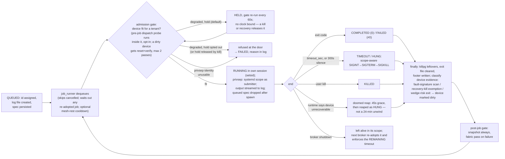

<!--
SPDX-FileCopyrightText: © 2026 Tenstorrent USA, Inc.

SPDX-License-Identifier: Apache-2.0
-->

# Jobs

Scope: the job subsystem — queue, runner, lifecycle, timeouts, retention, environment
resolution, process-group cleanup, log files, and job survival across a broker restart.
All in `server.py` unless named otherwise.

## Purpose

The broker exists to serialize all tenant access to one Tenstorrent device: every command
runs as a job, jobs run strictly one at a time, and every job leaves a complete durable
record (its log file) regardless of how it ended. The job subsystem is the main loop —
`job_runner` — plus the submission funnel (`_queue_job`) and the persistence that lets both
the queue and a running job outlive the broker process.

## Invariants

- **I1** — At most one job is RUNNING at any time. The runner is a single task that
  dispatches, awaits, and finalizes one job before dequeuing the next, and it MUST wait out
  any job re-adopted from a previous broker instance before dispatching
  (`readopted_scopes`).
- **I2** — `MAX_TIMEOUT_SEC` (1500 s / 25 min) is a hard ceiling on `timeout_sec`, clamped
  in `_queue_job` — the single funnel shared by the MCP tools and the REST route — never
  only at a tool schema. At the ceiling, the timeout message MUST NOT offer a way to raise
  it.
- **I3** — The job log file is created at queue time, before the job is enqueued, so it can
  be tailed immediately; it is the complete, durable record of the run (in-memory capture is
  a bounded tail, `JOB_CAPTURE_MAX_LINES`).
- **I4** — Every job starts in its own session (`os.setsid`), so pid == pgid, and the
  runner's `finally` block unconditionally `killpg`s the group (idempotent) so no orphaned
  child can hold the device after the job is finalized.
- **I5** — A job is never killed with bare SIGKILL first. Termination is the ladder SIGINT
  (`GRACEFUL_KILL_GRACE_SEC` = 60 s) → SIGTERM (`SIGTERM_GRACE_SEC` = 15 s) → SIGKILL,
  because only SIGINT unwinds a Python/ttnn job into the teardown that releases the device.
  A job running in a systemd scope (privsep, or re-adopted) MUST be signalled via the
  scope, never by `killpg` on the wrapper pid (`_terminate_job`).
- **I6** — A broker restart loses no job. RUNNING jobs are re-adopted from their
  `ttdev-job-<id>.scope` units; QUEUED jobs are restored from persisted specs in queue
  order; an unreadable spec is set aside (`.invalid`), never guessed at; a job whose
  process is already live is never revived from its spec (the scope, not the spec, owns
  it from dispatch on).
- **I7** — A re-adopted job keeps its original `timeout_sec` reservation, with time already
  served counted against it (`_readopted_deadline`); re-adoption never grants a fresh
  clock, and the deadline is enforced by `_monitor_readopted_scope`.
- **I8** — A job's exit status comes from the job itself: the shell preamble
  (`_exit_trap_preamble`) traps EXIT/TERM/INT and writes the status to
  `job_exit_file(job_id)`. A re-adopted job with no exit file MUST be reported FAILED,
  never "completed"; a signalled job records a real 128+N status.
- **I9** — Job ids ("000".."999", recycled) are never reissued while anything still answers
  to them: an in-memory job, a live scope, a reserved action/hold row, or a log among the
  newest `JOB_ID_RECENT_WINDOW` (200) log files. The counter is reseeded from the newest
  log name on restart (`seed_job_counter`).
- **I10** — A running job that produces no output for `HUNG_SILENCE_SEC` (default 300 s) is
  reaped as HUNG, with periodic silence notices before the reap; a job whose own output
  declares the device unrecoverable (`DOOMED_PATTERNS`) is reaped `DOOMED_GRACE_SEC`
  (default 45 s) after the declaration rather than waiting out its unwind. Setting either
  env knob to 0 disables that reaper.
- **I11** — Environment resolution priority is `env_file` > `inherited_env` > workspace
  defaults, and each level REPLACES the one below wholesale — no merging
  (`get_activation_script`). Env vars are resolved and validated once, at queue time; the
  env file is not re-read at dispatch.
- **I12** — Invalid submitter input (missing env file, unparseable YAML, non-dict content,
  missing python env) is returned as a structured refusal `{"error": ...}`, never a 500.
- **I13** — Finished jobs (COMPLETED / FAILED / TIMEOUT / KILLED) are removed from memory
  once older than `JOB_RETENTION_SEC` (300 s, `constants.py`); the log file remains the
  record. Sweeps run at runner events (job end, refusals, hold-loop passes), not on a
  standalone timer.
- **I14** — Every job end is classified for device evidence before the next dispatch: the
  log tail is scanned for runtime fault signatures (`_scan_output_for_device_fault`), and
  a wedge-risk end (KILLED / TIMEOUT / HUNG, or FAILED by signal under either the waitpid
  −N or shell 128+N convention — `_is_wedge_risk_exit`) marks the device dirty. This
  applies equally to re-adopted jobs. A job the broker's own recovery killed is exempt —
  a reset must not justify the next reset.
- **I15** — Job admission is blocking, not advisory: no job is dispatched onto a device the
  admission gate reports degraded. By default the job is HELD at the door and re-gated on
  `TENANT_HOLD_POLL_SEC` (60 s) until fit, with no clock bound (a kill releases the hold);
  with `TT_DEVICE_MCP_TENANT_HOLD=0` it is refused at the door as FAILED with the reason in
  its log. Gate internals are spec 03.

## Interfaces

Other subsystems and tenants may rely on:

- **Job states** (`JobStatus`): `queued`, `running`, `completed`, `failed`, `timeout`,
  `hung`, `killed`. Terminal: all but `queued`/`running`. `completed` means exit code 0;
  a non-zero exit is `failed`.
- **`Job` fields and properties**: `id`, `owner`, `workspace`, `command`, `queued_at`,
  `started_at`, `finished_at`, `exit_code`, `timeout_sec`, `log_file`, `env_vars`;
  computed `runtime_sec`, `wait_sec`.
- **MCP/REST surface** (schemas and routes are spec 02; names only):
  `tt_device_job_run` (queue + block, streams progress), `tt_device_job_run_bg`,
  `tt_device_job_status`, `tt_device_job_wait`, `tt_device_job_logs`,
  `tt_device_job_kill`, `tt_device_queue_status`, `tt_device_recent_jobs`. The REST
  routes the CLI uses call the same shared helpers (`_queue_job`, `_kill_job`,
  `_get_queue_status`, `_recent_jobs`).
- **Functions other specs consume**: `job_scope_unit` / `list_active_job_scopes`
  (recovery quiesce, deploy checks), `job_exit_file` / `read_job_exit_code`,
  `_terminate_job` (scope-aware kill, used by recovery), `write_job_log_footer`,
  `cleanup_finished_jobs`, module state `jobs`, `current_job_id`, `current_process`,
  `readopted_scopes`.
- **Job log format**: header block (`JOB ID`/`OWNER`/`WORKSPACE`/`COMMAND`/`ENV FILE`/
  `TIMEOUT`/`QUEUED` + `ENVIRONMENT VARIABLES`), a `[Started at <iso>]` marker, and a
  footer (`FINISHED`/`STATUS`/`EXIT CODE`/`WAIT TIME`/`RUNTIME`). `_recent_jobs` and
  `_job_from_log` parse it; the footer may sit up to `FOOTER_TAIL_LINES` (512) from the
  end because the post-job gate appends after it. Log names are
  `<YYYY-MM-DD_HHMMSS>_<id>.log`, so name order is time order.
- Owner format and kill authorization are spec 05. One jobs-side fact: submissions carry no
  owner; `_queue_job` derives it from the peer uid and the request surface.

## Behavior

### Submission

- All submit paths — `tt_device_job_run`, `tt_device_job_run_bg`, and the REST route the
  CLI and tt-run use — MUST funnel through `_queue_job`. Ceiling clamp
  (`max(1, min(timeout_sec, MAX_TIMEOUT_SEC))`), owner derivation, burst cap,
  and env validation all live there and nowhere else.
- Env resolution failures (I12) return `{"error": str}`; the job is not created.
- An optional per-owner burst cap (`TT_DEVICE_MCP_JOB_BURST_MAX`, default 0 = off) refuses
  a submission when the owner already has that many admitted inside
  `TT_DEVICE_MCP_JOB_BURST_WINDOW_SEC`, returning `retry_after_sec`. The attempt counts
  even if the submission later fails validation.
- On success `_queue_job` assigns the id (excluding ids held by live scopes), writes the
  log header (including the full resolved `ENVIRONMENT VARIABLES` block and the clamped
  `TIMEOUT`), creates the `Job`, persists its queued spec, enqueues it, and returns
  `job_id`, `status` (`starting` iff nothing is running and the device is not blocked,
  else `queued`), `position`, `log_file`, `owner`, `env_vars`. `tt_device_job_run` then
  blocks on completion, streaming log progress.

### Environment resolution

- Priority (I11): an `env` file (YAML dict, path relative to the workspace or absolute,
  values stringified) replaces everything; else `inherited_env` as passed by the client;
  else workspace defaults (`TT_METAL_HOME`, `TT_METAL_CACHE`, `PYTHONPATH`,
  `PYTHON_ENV_DIR`, `TT_METAL_ENV=dev`, `VLLM_TARGET_DEVICE=tt` derived from
  `<workspace>/tt-metal`).
- The CLI (`cli.py`) sends `inherited_env` only when no `-e` env file is given, and it
  captures only the `CAPTURED_ENV_VARS` allowlist (TT_METAL_*, PYTHONPATH,
  PYTHON_ENV_DIR, VIRTUAL_ENV, MESH_DEVICE, HF_HUB_CACHE, TT_CACHE_PATH, VLLM_*), not the
  whole caller environment.
- The venv to activate is chosen in order: `PYTHON_ENV_DIR` (from env file or inherited);
  `VIRTUAL_ENV` from inherited env only (never honored from an env file);
  `{TT_METAL_HOME}/python_env`; `{workspace}/tt-metal/python_env`. At queue time
  (`validate=True`) a missing venv is a refusal.
- The generated activation script exports every resolved var except `VIRTUAL_ENV`,
  sources `<python_env>/bin/activate`, and `cd`s to the workspace. At dispatch the script
  is rebuilt from the env vars resolved at queue time; the env file is not re-read.

### Queueing and dispatch

- The queue is FIFO (`asyncio.Queue` of job ids). Each queued job's spec is persisted as
  `<log_dir>/queued/<id>.json` (I6) and forgotten only after its process is live — a
  broker dying between dispatch and spawn must not lose the job; one dying after spawn
  must not run it twice.
- A job cancelled while queued becomes KILLED (terminal); the runner skips it at dequeue
  and forgets its spec.
- Before dispatch the runner, in order: waits out any re-adopted job; sleeps out the
  optional mesh-rest cooldown (`TT_DEVICE_MCP_JOB_COOLDOWN_SEC`, default 0; only the
  unspent remainder since the last job's device work ended); awaits an external
  scheduler's step reservation if one is held (`get_external_step_free_event` — a Slurm
  pre-step/post-step gate call in progress; spec 03 I29 owns the mechanism); runs the
  admission gate (I15). Two failure shapes there are distinct and both deliberate: a gate pass that runs
  but cannot verify records the device unverified — "tried and could not tell" is an
  affirmative hold; an exception *escaping* the admission predicate (a gate bug) MUST NOT
  block dispatch — only an affirmative degraded verdict blocks, so a gate bug never turns
  into a stuck queue (its cost is one ungated dispatch instead). Finally the runner
  refuses the job if privsep is active but the submitter identity cannot
  be honored (running it as root instead is forbidden — spec 05).
- Refusals at the door (degraded device, privsep) terminalize the job as FAILED, append a
  `[REFUSED ...]` note and footer to its log, and record completion stats.

### Execution

- The command runs under `/bin/bash` as: exit-trap preamble (I8) + `set -e` + activation
  script + the command. Under privsep it runs inside a transient systemd scope named
  `job_scope_unit(job_id)` (`ttdev-job-<id>.scope`) as the submitting uid; otherwise
  directly. Both paths use `preexec_fn=os.setsid` (I4).
- Every step from the `[Started at]` log line on — the activation script, the privsep
  prefix, the spawn — runs inside the runner's `try`. If one raises
  (a full disk is enough), the job ends FAILED with an `[EXCEPTION: ...]` note, its queued
  spec is forgotten, and the runner goes on to the next job; it never dies with the job
  left RUNNING. A footer write that fails is logged, not raised.
- stdout/stderr are streamed line-by-line to the log file (timestamped, `[stdout]` /
  `[stderr]` prefixed) through a single line-buffered handle, and into bounded in-memory
  deques. Broker-side annotations use a `[broker]` prefix. Every line resets the silence
  clock; the clock starts at spawn so a job that never speaks is still measured.
- `asyncio.wait_for(..., timeout=job.timeout_sec)` bounds the run. On expiry the job is
  terminated via `_terminate_job` (scope-aware, I5) and becomes TIMEOUT, with
  `timeout_hint()` explaining the limit — actionable below the ceiling, non-negotiable at
  it.
- The hung watchdog (I10) announces silence every `HUNG_NOTICE_SEC` (60 s) in the job's
  log, then reaps at `HUNG_SILENCE_SEC` as HUNG; the doomed reap fires first if the
  runtime declared the device unrecoverable. Both kill the process so the streams hit EOF
  and the normal completion path runs; neither may relabel a verdict already reached
  (e.g. a user kill).
- A user kill of a RUNNING job (`_kill_job`) sets KILLED, then terminates outside the
  lock via `_terminate_job` so the job can release the device before SIGKILL.

### Completion

- Exit code semantics: preserved verdicts (KILLED, HUNG) win; otherwise exit 0 →
  COMPLETED, anything else → FAILED. The bounded capture is materialized into
  `job.output` / `job.error` and the deques dropped.
- The `finally` block: `killpg` the group (I4), clear the job's exit file (this broker
  saw the exit itself), stamp `finished_at`, record stats, classify device evidence
  (I14), write the log footer, run the post-job health gate
  (`_verify_device_after_job` — snapshot always, fabric traffic pass forced on any
  non-success; internals spec 03), mark the mesh-rest clock, and sweep retention (I13).
  The finished job's caller is released before the post-job gate, so the gate never
  bills the finished job.
- A job killed by the broker's own recovery gets the real cause written into its error
  and log (`killed by device recovery: ...`) instead of being read as its own crash.

### Broker shutdown and re-adoption

- On broker shutdown (CancelledError in the runner) a RUNNING job is left alive in its
  scope — no kill, no footer — for the next broker to re-adopt.
- At startup, `reconcile_running_scopes` re-adopts every active `ttdev-job-*.scope`:
  the job is reconstructed from its log header (`_job_from_log` — owner, command,
  queued/started, TIMEOUT), registered RUNNING, and `_monitor_readopted_scope` polls the
  scope, enforcing the remaining timeout (I7) and finalizing from the job's exit file
  (I8). The finalize path mirrors the normal evidence classification (I14) and writes the
  footer. `_restore_queued_jobs` then re-queues persisted specs in order (I6).
- While `readopted_scopes` is non-empty the runner dispatches nothing (I1).

### Retention and ids

- `cleanup_finished_jobs` removes finished jobs older than `JOB_RETENTION_SEC` from
  `jobs`; history beyond that is served from log files (`_recent_jobs`).
- Id assignment (I9): monotonic 3-digit counter, wrapping, skipping every id still in
  use; reseeded from the newest log name across restarts so ids never run backwards.

## Design decisions

- **One funnel for submission.** The ceiling, burst cap, and owner derivation are enforced
  in `_queue_job` because the REST path passes `timeout_sec` through raw; clamping only
  at the MCP schema left the limit unenforced on the path people actually submit
  through. Rejected: per-transport enforcement.
- **The hard ceiling has no knob.** A run that cannot fit in 25 minutes on a shared
  device is reshaped (move off-device work off, split the selector), not granted more.
  The at-ceiling message deliberately refuses to name a bigger number so agents don't
  learn to ask for one.
- **SIGINT-first termination.** Python installs no SIGTERM handler: SIGTERM kills the
  interpreter without unwinding, atexit/fixture teardown never runs, ttnn never closes
  the mesh, and the eth cores are left mid-transaction — for a Python job SIGTERM is no
  gentler than SIGKILL. The 60 s SIGINT window covers a real Galaxy mesh teardown; at
  10 s every timeout escalated to SIGKILL and wedged eth cores. Rejected: TERM-first
  and short grace windows.
- **Scope-aware kill.** systemd reparents a privsep payload into the scope's cgroup, so
  `killpg` on the broker-held pid hits only the systemd-run wrapper and leaves the real
  job running mid-CCL (observed: exit code None on a wedged fabric). Signal the scope;
  fall back to the process group only for unscoped jobs.
- **Jobs self-report exit status.** A scope reports its exit only to its spawner, and
  the spawner may be a dead broker. The EXIT-trap file is the only honest record across
  a restart; before it, every re-adopted job was reported "completed". The signal traps
  exist because `$?` in an EXIT trap after a signal death would read 0 — the same lie by
  a different road.
- **Queue persistence as spec files, not a database.** Restarts are routine
  (auto-update deploys on idle windows); an in-memory queue silently ate waiting jobs.
  One JSON file per queued job, dropped at spawn, keeps the restore path trivial and
  the failure mode legible (`.invalid` set-asides).
- **Short recycled ids.** 3-digit ids are typeable; safety comes from the in-use
  exclusion set (memory + scopes + recent logs + reserved rows), not from uniqueness.
  Rejected: UUIDs (hostile to humans reading `status`/logs).
- **Bounded in-memory capture.** String `+=` accumulation is O(n) per line and starved
  the event loop under chatty jobs; capped deques keep appends O(1) while the log file
  keeps everything.
- **Log file as source of truth from queue time.** Tailable immediately, survives the
  broker, and is the substrate for re-adoption (`_job_from_log`) and history
  (`_recent_jobs`).
- **Hold-by-default admission.** A queue should hold jobs while the device recovers, not
  bounce them; the hold became the default once the recovery ladder bounded it. The
  fail-fast refusal remains as opt-out. The hold re-runs the full gate each pass because
  a passive predicate can never clear the dirty flag it is waiting on.

## Test anchors

| Claim | Test(s) |
|---|---|
| I1 | `tests/test_readopt.py::test_reconcile_readopts_running_scope`, `tests/test_readopt.py::test_startup_waits_for_a_readopted_job_before_touching_the_fabric` |
| I2 | `tests/test_device_safety.py::test_rest_submit_clamps_timeout_to_the_hard_ceiling`, `tests/test_device_safety.py::test_max_timeout_is_25_minutes_and_is_a_hard_ceiling`, `tests/test_device_safety.py::test_hitting_the_ceiling_does_not_offer_a_bigger_number`, `tests/test_server.py::test_timeout_hint_is_actionable` |
| I3 (bounded capture) | `tests/test_server.py::test_job_output_capture_is_bounded` |
| I5 | `tests/test_server.py::TestCleanDeviceGate::test_graceful_terminate_on_sigterm`, `tests/test_server.py::TestCleanDeviceGate::test_graceful_escalates_to_sigkill`, `tests/test_server.py::TestCleanDeviceGate::test_graceful_terminate_already_dead`, `tests/test_reset.py::test_terminate_job_signals_the_scope_for_a_privsep_job`, `tests/test_reset.py::test_terminate_job_falls_back_to_killpg_without_a_scope`, `tests/test_reset.py::test_a_live_privsep_kill_signals_the_scope_not_the_pgroup` |
| I6 | `tests/test_device_safety.py::test_a_queued_job_survives_the_broker_restarting_under_it`, `tests/test_device_safety.py::test_an_unreadable_queued_spec_is_set_aside_not_guessed_at`, `tests/test_device_safety.py::test_a_started_job_is_not_revived_by_a_restart`, `tests/test_readopt.py::test_reconcile_readopts_running_scope`, `tests/test_readopt.py::test_reconcile_skips_already_tracked`, `tests/test_readopt.py::test_a_restored_queue_survives_when_main_already_started_the_runner` |
| I7 | `tests/test_readopt.py::test_readopted_deadline_counts_time_already_served`, `tests/test_readopt.py::test_readopted_job_past_its_deadline_is_terminated`, `tests/test_readopt.py::test_readopted_job_inside_its_deadline_is_left_alone`, `tests/test_readopt.py::test_job_from_log_recovers_the_deadline`, `tests/test_readopt.py::test_job_from_log_without_a_timeout_header_still_gets_a_deadline` |
| I8 | `tests/test_readopt.py::test_readopted_job_recovers_its_real_exit_code`, `tests/test_readopt.py::test_readopted_job_that_passed_is_reported_as_passed`, `tests/test_readopt.py::test_readopted_job_with_no_exit_status_is_not_called_completed`, `tests/test_readopt.py::test_a_signalled_job_records_a_real_exit_status`, `tests/test_readopt.py::test_the_job_exit_dir_is_redirectable` |
| I9 | `tests/test_server.py::test_next_job_id_is_3_digit_and_wraps`, `tests/test_server.py::test_next_job_id_skips_live_ids`, `tests/test_server.py::test_seed_job_counter_resumes_across_restart`, `tests/test_server.py::test_seed_job_counter_wraps_at_999`, `tests/test_server.py::test_a_restart_does_not_reissue_an_id_a_log_still_holds`, `tests/test_server.py::test_no_id_in_the_recent_window_is_ever_reissued`, `tests/test_recent_jobs.py::test_a_reserved_action_id_is_not_handed_to_another_job` |
| I10 | `tests/test_device_safety.py::test_a_silent_job_is_reaped_as_hung`, `tests/test_device_safety.py::test_hung_silence_of_zero_disables_the_reaper`, `tests/test_device_safety.py::test_the_doomed_grace_lets_the_backtrace_land`, `tests/test_device_safety.py::test_doomed_grace_of_zero_disables_the_doomed_reaper` |
| I11 | `tests/test_server.py::TestActivationScript::test_activation_script_default`, `tests/test_server.py::TestActivationScript::test_activation_script_with_env_file`, `tests/test_server.py::TestActivationScript::test_activation_script_inherited_env`, `tests/test_server.py::TestActivationScript::test_activation_script_python_env_dir_over_virtual_env`, `tests/test_server.py::TestActivationScript::test_activation_script_virtual_env_fallback`, `tests/test_server.py::TestEnvFile::test_load_env_file_converts_to_strings` |
| I12 | `tests/test_device_safety.py::test_rest_submit_bad_env_file_is_a_refusal_not_a_500`, `tests/test_server.py::TestEnvFile::test_load_env_file_not_found`, `tests/test_server.py::TestEnvFile::test_load_env_file_invalid_format`, `tests/test_server.py::TestActivationScript::test_activation_script_validate_missing_env` |
| I14 | `tests/test_server.py::TestCleanDeviceGate::test_wedge_risk_truth_table`, `tests/test_device_safety.py::test_a_hung_job_is_treated_as_a_wedge_risk`, `tests/test_server.py::test_scan_output_detects_eth_core_fault`, `tests/test_server.py::test_scan_output_finds_signature_in_tail_of_large_log`, `tests/test_readopt.py::test_a_readopted_job_that_wedged_the_mesh_flags_the_device` |
| I15 | `tests/test_device_safety.py::test_hold_mode_holds_a_degraded_device_then_dispatches_when_fit`, `tests/test_device_safety.py::test_hold_mode_self_heals_a_dirty_device_by_re_running_the_gate`, `tests/test_device_safety.py::test_exhausting_the_verify_budget_does_not_dispatch`, `tests/test_device_safety.py::test_tenant_gate_writes_one_held_and_one_released_per_episode` |
| B-Submission (burst cap) | `tests/test_device_safety.py::test_an_armed_burst_cap_refuses_one_owners_flood_but_not_another`, `tests/test_device_safety.py::test_the_default_off_burst_cap_admits_every_submit`, `tests/test_device_safety.py::test_job_burst_decision_prunes_the_window_and_gates_on_the_cap[2-60.0-recent2-110.0-False-50.0-expect_kept2]` |
| B-Submission (owner derived from the peer uid and the surface) | `tests/test_device_safety.py::test_the_owner_comes_from_the_peer_uid_and_the_surface` |
| B-Submission (blocking run) | `tests/test_server.py::test_a_blocking_job_run_reports_progress_through_the_mcp_layer` |
| B-Queueing (cooldown) | `tests/test_device_safety.py::test_an_armed_cooldown_rests_the_mesh_before_the_next_job`, `tests/test_device_safety.py::test_the_default_off_cooldown_never_delays_a_job`, `tests/test_device_safety.py::test_job_cooldown_remaining_is_only_the_unspent_rest[30.0-100.0-110.0-20.0]` |
| B-Queueing (gate errored → device held) | `tests/test_device_safety.py::test_a_gate_that_errored_holds` |
| B-Queueing (gate bug ≠ stuck queue) | `tests/test_device_safety.py::test_a_non_dict_job_on_disk_never_poisons_the_gate`, `tests/test_device_safety.py::test_a_non_str_since_on_disk_never_poisons_the_gate` |
| B-Execution (setup error fails the job, not the runner) | `tests/test_device_safety.py::test_a_setup_error_after_running_fails_the_job_not_the_runner` |
| B-Log format | `tests/test_recent_jobs.py::test_recent_jobs_parses_and_limits`, `tests/test_recent_jobs.py::test_the_footer_survives_a_reset_worth_of_gate_output`, `tests/test_recent_jobs.py::test_a_job_printing_status_of_its_own_is_still_unfinished` |
| B-Ids/`Job` basics | `tests/test_server.py::TestJob::test_job_status_values`, `tests/test_server.py::TestJob::test_runtime_sec_property`, `tests/test_server.py::TestJob::test_wait_sec_property` |
| Re-adoption scope naming | `tests/test_readopt.py::test_scope_unit_roundtrip`, `tests/test_readopt.py::test_list_active_job_scopes_parses` |
