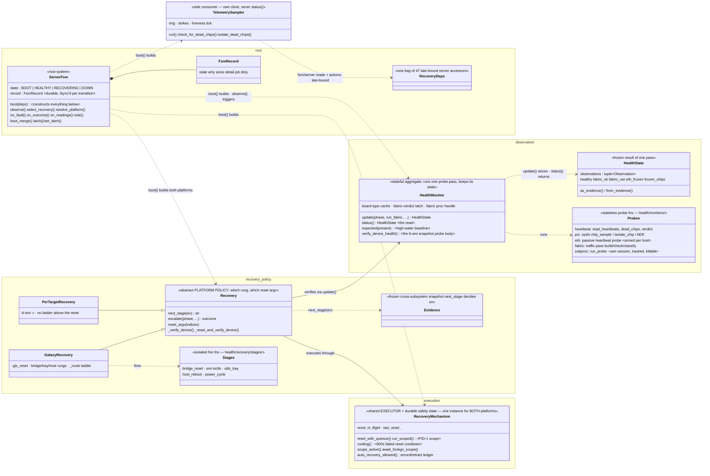
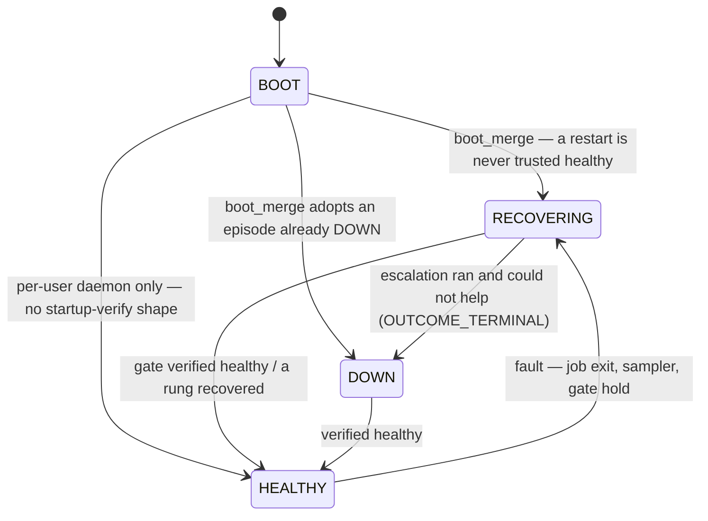
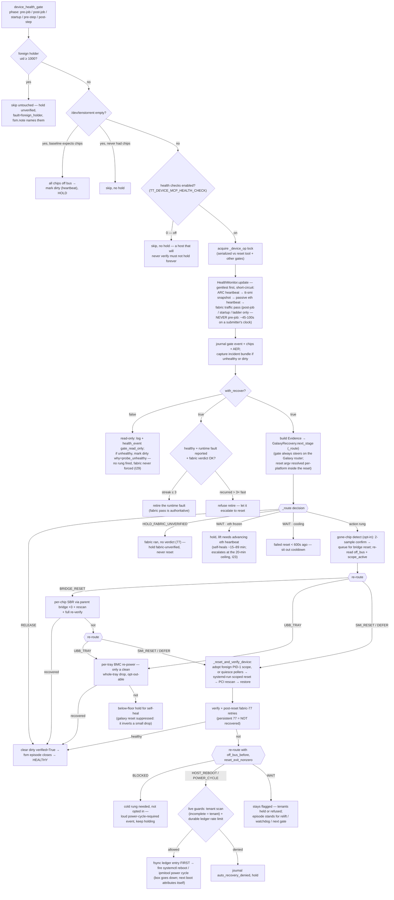

<!--
SPDX-FileCopyrightText: © 2026 Tenstorrent USA, Inc.

SPDX-License-Identifier: Apache-2.0
-->

# Health

Scope: the ServerFsm root system, HealthMonitor and its probes (heartbeat, pci/snapshot, eth,
fabric, subproc), TelemetrySampler, the between-job health gate, the boot flow and platform
resolution, and the degraded-hold / self-heal-relift model. Recovery policy and reset execution
(the ladder, platforms, `RecoveryMechanism`, stages) are spec 04; this spec describes only the
seam into them.

## Purpose

The broker must never dispatch a tenant job onto a wedged mesh, and must never let a wedge it
detected go unrecorded or unresolved. The health subsystem is the one owner of "is the device fit
for a tenant": a durable state machine (`fsm.ServerFsm`) roots a probe aggregate
(`health.monitor.HealthMonitor`), an always-on sampler (`telemetry.TelemetrySampler`), and the
between-job gate (`server._device_health_gate`) that decides hold, release, or escalation at every
job boundary.

## Invariants

- **I1 — Singletons are constructed exactly once, at boot, never per gate pass.**
  `server.boot_broker()` calls `ServerFsm.boot(RecoveryDeps)` once (guarded by `server._booted`);
  a fresh `HealthMonitor` would lose the fabric-verdict latch (`last_fabric_ok`) and the in-flight
  fabric-process handle, a fresh `RecoveryMechanism` the reset cooldown and durable ledger state.
  (Unanchored: enforced by `boot_broker`'s `_booted` guard and asserted for the suite in
  tests/conftest.py.)
- **I2 — Importing `server.py` never touches the device.** Boot (and the platform probe) runs at
  broker start, never at import.
- **I3 — Every FSM transition is persisted durably** — the whole record, atomic replace
  (same-directory temp file, `fsync`, `os.replace`), so state/why/since/dirty/latches survive a
  broker restart and a crash never exposes a half-written file. A persist failure degrades to
  in-memory-only, logged once, never a raised exception into the gate.
- **I4 — A restart is never trusted healthy.** `ServerFsm.boot_merge` always closes the door:
  RECOVERING(`startup_unverified`) absent an open episode; an episode still open on disk
  (RECOVERING or DOWN) is adopted unconditionally. There is no "clean boot, skip the verify"
  branch. Only the forced startup gate pass may open the door.
- **I5 — `why` is a closed vocabulary** (`fsm.FAULTS`). An unknown value asserts at the write
  site and clamps to `gate_error`; an unknown value read from disk clamps silently. The idle
  relift and the escalation routing branch on exact membership, so a value outside the set is a
  routing bug, not free text.
- **I6 — A cross-boot load voids the job context but keeps the device facts.**
  state/why/since/detail/latches/dirty all survive a reboot; only `job` is cleared (it cannot have
  survived), and `dirty` is deliberately NOT cleared — fail closed toward the owed reset attempt.
- **I7 — `OUTCOME_WAITING` never transitions the FSM.** Only `recovered` closes an episode
  (→ HEALTHY) and only `terminal` reaches DOWN; a platform with no ladder (per-target) reports
  waiting forever and must never be read as DOWN.
- **I8 — One UNHEALTHY observation makes the pass unhealthy; SKIPPED never heals.** A probe that
  could not run learned nothing, and a pass is healthy only when no probe that ran said otherwise.
  A crash or hang inside a check is UNHEALTHY, not inconclusive (`health.core.Verdict`).
- **I9 — Probe order is gentlest-first with short-circuit.** `HealthMonitor.update()`: host PCI →
  ARC heartbeat → tt-smi snapshot → passive eth heartbeat → fabric traffic pass. A failed host-PCI
  check, a frozen heartbeat, or a failed snapshot skips everything heavier; a frozen eth core MUST
  block the traffic pass (the pass is what shoves a frozen chip off the PCIe bus); an eth SKIP
  falls through to the pass.

  **Host PCI** (`monitors/hostpci.py`) leads because it is the only probe that needs nothing to
  have worked yet: pure sysfs bus reads, no device open, no ioctl, no UMD. It judges two things,
  both of which make the device unusable and neither of which any other probe can see — every
  Tenstorrent function on the bus is bound to tt-kmd, and no implemented BAR is left unassigned.
  A chip whose driver never bound has no `/sys/class/tenstorrent` entry at all, so the heartbeat
  is simply absent for it and the tt-smi snapshot fails for a reason it cannot name. UNHEALTHY
  rather than evidence because both faults are ones the gentlest rung repairs: a PCI rescan
  re-binds a driver that failed to attach, and places a BAR left unassigned after hotplug.

  The BAR rule is `flags != 0 && start == 0`. `flags` non-zero is what says the BAR exists — an
  unimplemented BAR reads all zeros across start, end and flags, and a 64-bit BAR leaves its
  second slot that way too — so a start of zero only means "unplaced" when there was something to
  place. Judging on the address alone reports every healthy device as broken and holds it.

  Everything else the probe reads is evidence and never alerts: IOMMU grouping and mode, link
  speed and width, and AER totals on the endpoints **and their upstream bridges**. A correctable
  count is a trend, not a state — non-zero is ordinary on a healthy link — but the bridge half of
  the documented wedge-to-host-reboot path was not being recorded at all. `Verdict` has no third
  state by design (`health/core.py`), so a fact that must not alert belongs in `evidence`, never
  in a verdict.

  **Host-software floors are reported at boot, never enforced.** The startup preflight warns when
  tt-kmd is below `TT_DEVICE_MCP_KMD_MIN_VERSION` (2.9.0) or any chip's firmware bundle is below
  `TT_DEVICE_MCP_FW_MIN_VERSION` (19.11), both read from sysfs — `/sys/module/tenstorrent/version`
  and `tt_fw_bundle_ver`. Always a warning: an old bundle is a configuration gap, not a missing
  recovery capability, and a broker that refused to start over one would deny service for
  something nobody asked it to enforce. What it buys is the explanation for a probe result above
  — below bundle 19.9 the eth link-status telemetry is unpopulated, so the eth probe SKIPs, and
  without this line that skip reads as a broken probe rather than a host that cannot answer.
  Versions compare element-wise as integers, because `19.7.1.0` is below `19.11` and a string
  comparison says the opposite — wrong in the one direction that matters. tt-smi's own version is
  deliberately not checked: reading it means spawning tt-smi, and a boot-time probe that shells
  the device tool is the one thing a wedged host cannot afford.
- **I10 — `HealthMonitor.status()` never probes and never blocks.** It is the read side of the
  last `update()` pass — `None` before one has run — and may be minutes stale by contract.
- **I11 — `expected()` is a high-water baseline, never the survivor count.** A mesh that lost a
  tray must not lower its own bar. `TT_DEVICE_MCP_EXPECTED_CHIPS` overrides; the baseline only
  ratchets up; an unreadable baseline file fails closed to a nonzero expectation (its existence
  proves the host has shown chips).
- **I12 — The fabric traffic pass never runs on a submitter's clock.** Pre-job the gate never
  runs it, dirty or not — the flag is already the answer. It runs post-job on a failed job
  (forced), at startup (forced), inside the recovery ladder, and on a `run_fabric` caller only
  when no pass is fresher than `FABRIC_CHECK_MIN_INTERVAL_SEC` (default 1200s).
- **I13 — The gate never resets over a tenant.** A foreign holder (uid ≥ `MIN_TENANT_UID`,
  1000) skips the gate untouched: verification is deferred, an existing hold outlives the skip
  (`why=foreign_holder`), and `fsm.note` names the holder. The host rungs re-scan at fire time,
  and an incomplete scan counts as a tenant. The skipped probes are not waved through: the next
  job is not dispatched while the holder stays (spec 01 I15).
- **I14 — Absence is never health.** An empty `/dev/tenstorrent` on a host whose baseline expects
  chips is every chip off the bus: mark dirty (`why=heartbeat`), hold, never release. A host that
  has never shown a chip skips with no hold — nothing there will ever verify.
- **I15 — Only proof releases.** A clear that verified (full pass) closes the episode; an
  unverified clear drops only the dirty bit (ends the RESETTING, never the doubt) and leaves the
  door held, with a durable `device_dirty_cleared` event naming whether it was verified.
- **I16 — A frozen active-eth-core verdict is held, never reset**, dirty or not: it is the
  self-healing (~15–89 min) single-chip wedge, and the galaxy reset is the measured all-chip drop.
  Falling through to the reset needs both kill switches off: the hold's
  (`TT_DEVICE_MCP_ETH_FREEZE_HOLD=0`) AND the mass-drop floor's
  (`TT_DEVICE_MCP_RESET_MIN_DEAD_FRAC=0`, spec 04).
  A read that hangs past the caller's bound is frozen-core evidence (False), not a skip.
- **I17 — A fabric pass that ran but reached no verdict (exit 77) holds fabric-unverified and is
  never a reset trigger.** enum+ARC cannot see a wedged eth core, so "could not check" must not
  read as fit, and 77 is not a fault a reset fixes. Only a real healthy fabric verdict lifts it.
- **I18 — A healthy device is not reset because a job ended badly.** A timeout or kill is a
  reason to look hard (the full check, fabric included, post-job), then believe the answer. The
  one exception is a runtime-reported device fault, which outranks checks that are blind to it.
- **I19 — `TelemetrySampler` never reads `HealthMonitor.status()`.** It samples raw sysfs on its
  own clock (`SAMPLE_INTERVAL_SEC`) — status() is the last gate pass, minutes stale, and the gate
  can itself be stuck inside a fabric check holding the device lock. Its dead-chip isolation is
  deliberately lock-free, requires two consecutive all-ones samples, is suppressed while a reset
  scope is live (a reset reads all-ones by design), treats an all-chips blackout as a global event
  (report, never amputate), and kills device holders BEFORE removing the endpoint — a mapping
  outlives the endpoint and a read through it stalls a CPU core and reboots the host.
- **I20 — A stalled sampler withholds the systemd watchdog ping.** The escalation ladder must
  never sit silently behind a dead sampler; a stall past `STALL_SEC` gets the broker restarted.
- **I21 — The idle relift lifts a hold only on proof, read-only for self-heal holds.**
  `eth_frozen` lifts only on a positively-advancing eth heartbeat; `off_bus` lifts on enum+ARC
  (the chip returns visibly) unless the eth read is affirmatively frozen or the last fabric
  verdict is UNHEALTHY; a skip (`None`) never overwrites the fabric latch. The relift is
  rate-limited (`SELFHEAL_RELIFT_INTERVAL_SEC`, default 120s), single-flight, re-checks every
  guard under the device-op lock, and bails when the hold was re-dirtied or a chip drops
  mid-verify — a dirty device belongs to the pre-job gate.
- **I22 — The fabric relift is the only relift path that runs the traffic pass, and it is off by
  default** (`TT_DEVICE_MCP_FABRIC_RELIFT`). It lifts only on an explicit healthy verdict; a 77
  on retry or a failure holds. With it off, a fabric-unverified hold falls into the generic
  escalate category rather than standing forever.
- **I23 — Every hold terminates.** The hold-deadline watchdog puts a stuck hold on the durable
  timeline once per window; past the ceiling (`_stuck_hold_ceiling_sec`, default 1200s; off-bus
  holds get one early attempt at `_offbus_hold_ceiling_sec`, default 120s) a tenant-free hold is
  force-escalated through the gate's own gentlest-first ladder (spec 04). Both re-arm per episode.
- **I24 — `server.py`, `fsm.py`, and `telemetry.py` import health only through the
  `tt_device_mcp.health` facade** — enforced by an AST walk over those files.
- **I25 — `TT_DEVICE_MCP_HEALTH_CHECK=0` skips the gate with no hold.** A host that will never
  verify must not shut the door once and forever. Set by an operator, or by preflight when a
  non-root daemon has no tt-smi; no install shape sets it.
- **I26 — The evidence dict keeps the legacy vocabulary.** `HealthState.as_evidence()` emits
  `{"heartbeat": .., "snapshot": .., "eth_heartbeat": .., "fabric": ..}` (the `pci` observation
  relabels to `snapshot`; heartbeat's verdict key is `verdict`, not `ok`) and
  `from_evidence()` round-trips it — the durable journal and the test fakes are built on it.
- **I27 — Platform resolution commits nothing it cannot prove.** A declared
  `TT_DEVICE_MCP_RESET_MODE` commits without touching the device; otherwise one boot snapshot
  caches board types and decides; an unreadable mesh commits nothing and the per-pass fallback
  stands (pinning per-target on a degraded Galaxy would ship the reset that cannot recover it).
  A probe that raises never stops the broker booting.
- **I28 — The eth-heartbeat rung arms itself per host, once per broker start.** The startup
  self-test times the read; a fast answer arms (a frozen verdict still counts as armed — the read
  worked), a read that never measured leaves the rung off, loudly, and a disarmed reader skips —
  it never delivers a HOLD.
- **I29 — An externally-driven read-only pass records but never acts.** `with_recover=False`
  journals its verdict, holds an unhealthy device, and freezes an incident bundle, but enters no
  rung of the ladder and never runs the fabric traffic pass regardless of `run_fabric`,
  `force_fabric`, or a dirty device. An unhealthy verdict marks the device dirty with
  `why="probe_unhealthy"` (`fsm.FAULTS`) — never `job_killed`, since no job is in play — leaving
  the device dirty for the next gate: the prologue that drives it is on the critical path of every
  node in an allocation; the recovery it declines is the epilogue's work (spec 07 `post-step`).

  `post-step`'s recovering pass (`with_recover` defaulted True) is bound by
  `TT_DEVICE_MCP_POST_STEP_DEADLINE_SEC` (default 600s), as ONE absolute deadline for the WHOLE
  route — the reclaim and the gate together, not the gate alone. `deadline_at =
  time.monotonic() + deadline_sec` is computed once, before the reclaim starts; the reclaim
  (`_run_step_reclaim`) and the gate (`_run_step_gate`) each get whatever of that budget remains
  when they start, not a fresh allotment apiece. Splitting the deadline this way — rather than
  starting the clock only once the reclaim returns — matters because reclaim itself is not free:
  it can run two rounds (SIGTERM, then SIGKILL) with a real grace sleep between them, and a
  genuine ladder climb after it can exceed the budget on its own — a `tt-smi -r` alone runs ~15s,
  post-reset fabric retries add 45-100s each behind a 60s sleep, and a wedged mesh has measured a
  255s fabric timeout — two or three of those and 600s is gone regardless of the reclaim.

  The deadline bounds the ROUTE'S REPLY, not either phase's device work: both the reclaim and the
  gate run as background tasks and, on the deadline, the route returns `inconclusive` and leaves
  whichever task is still running — never cancelled. Reclaim SIGTERMs/SIGKILLs real processes, so
  cancelling it mid-round is exactly as unsafe as cancelling the gate mid-device-op; the gate's own
  device work happens in `asyncio.to_thread` calls (holder scans, heartbeat reads, snapshots,
  incident capture), and a cancellation cannot stop a thread already running — cancelling the
  coroutine around it only unwound the gate's `async with _device_op(...)`, releasing the lock
  while the thread kept touching the device — exactly the case a hung read produces, since a
  stalled read is *why* the deadline fires in the first place. Never cancelling either phase, and
  holding both `_device_op` and the reservation below until whichever task is running actually
  completes, is what keeps a second gate or a freshly dispatched job from overlapping it. (Spec 07
  I9 covers the CLI/exit-code side of this.)

  A step reserves the device against job dispatch (`_reserve_external_step` /
  `get_external_step_free_event`) from immediately after its in-flight check — before `post-step`'s
  reclaim runs, not just before the gate — until whichever background task the route is waiting on
  finishes, released from that task's own done-callback rather than when the step's reply is sent.
  Because reclaim and the gate run sequentially under the SAME token, only one of them ever owns
  the eventual release at a time: a done-callback is attached to reclaim's task only when reclaim
  itself overruns the deadline (the route then returns without ever calling the gate); on a normal,
  in-budget reclaim, nothing releases yet and the token passes straight to `_run_step_gate`, which
  attaches its own. `job_runner` awaits the reservation before it ever calls
  `_ensure_device_clean_for_next_job` or spawns a job's process, so a job cannot dispatch underneath
  a step's holder scan, its `_device_op`, or (for `post-step`) its straggler reclaim — closing the
  window where the reclaim's own `to_thread` hand-off used to let a freshly dispatched job's
  process be misread as a stale straggler and SIGTERM/SIGKILLed. This is one-directional (the step
  never waits on the runner), so there is no lock and no cycle to deadlock on; `_device_op` itself
  cannot be held across the gate call for the same reason (`device_health_gate` acquires that same
  non-reentrant lock internally).

  **Step routes serialize against each other.** Both wait out any reservation already held
  (`_await_external_steps_clear`) before taking their own, bounded by the route's one absolute
  deadline. Overlapping was the earlier design and it was wrong: an Epilog and the next Prolog
  can each pass the in-flight check during the OTHER's pre-`_device_op` window (for `post-step`
  that window is the reclaim's own grace sleeps, up to ~20s), and a Prolog that answers in that
  window reads the epilogue's stragglers as foreign holders, reports the mesh `unfit`, and drains
  the node plus requeues the job (spec 07 I9) over a device that was seconds from being handed
  over clean. Its probes also run concurrently with the reclaim's signals, and two reclaims would
  interleave SIGTERM/SIGKILL rounds and each audit kills the other may have made.

  Waiting rather than refusing, because a refusal has the identical drained-node outcome.
  `external_step_active` therefore still never joins `_broker_work_in_flight`'s refusal
  predicate. The wait costs nothing in the ordinary case — nothing is reserved, so it returns at
  once — and a step still holding the device when the deadline expires means a recovery genuinely
  is in progress, so `inconclusive` is the true answer there, not a false verdict from a gate that
  never ran. The loop re-checks after every wake rather than trusting one event fire, so a step
  that reserves between the event being set and the waiter resuming is waited on too.

  The reservation is keyed by token (`_external_step_holders: dict[token, phase]`), not a plain
  flag. Two simultaneous holders are no longer reachable through the routes, but the keying is
  what makes relying on that serialization safe: a release clears only its own claim, and a
  double release (a bug, or a caller's own cleanup racing its task's done-callback) is a no-op
  instead of an under-count that would free the device while a still-live token remains.
  `get_external_step_free_event` is `set()` only when the holder map is empty.

  Both step routes ALSO refuse up front while the device is not idle of broker work
  (`_broker_work_in_flight`): a queued or running job, a running job's own teardown window (a job
  that just went `HUNG` is no longer `RUNNING`, but the runner still owns the device until it
  reaps the process and clears its own bookkeeping — read from that bookkeeping directly, not
  `JobStatus`, so this window is covered), or a broker device op already in flight outside any job
  (a reset, a fabric pass). This check is a snapshot, not a lock — the reservation above is what
  actually excludes job dispatch — but it still matters for what the reservation does not cover: an
  operator's own `tt_device_reset` takes `_device_op` directly and answers to nothing the
  reservation gates. `post-step` re-checks it after the reclaim returns and before the gate, so a
  reset that started during the reclaim's `to_thread` yield still stops the gate from running over
  it; a second refusal there still carries whatever the reclaim already found
  (`reclaimed`/`survivors`).

  A gate call that raises (rather than times out) still must produce a verdict, never an unhandled
  500 — both routes catch it via the gate task's outcome. The two routes are asymmetric here
  exactly as their in-broker twins are: `post-step`'s twin (`_verify_device_after_job`) marks the
  device dirty with `why="gate_error"` on a gate exception, so `post-step`'s gate task's
  done-callback does the same; `pre-step`'s twin (`_ensure_device_clean_for_next_job`) only clears
  and retries, taking no destructive action, so the read-only `pre-step` marks nothing and reports
  `inconclusive` — it found nothing it can vouch for, and marking the device dirty on the strength
  of an exception a read-only pass never diagnosed is not this pass's call to make. Marking dirty
  happens in the done-callback, not in the route's reply path, so it still happens even when the
  exception arrives after the deadline already sent an `inconclusive` reply. That same
  done-callback MUST retrieve the task's exception (`task.exception()`) whether or not it acts on
  it — skipping that logs "Task exception was never retrieved" at garbage collection, the asyncio
  warning this project's own history already hit once for the previous `wait_for`-based version of
  this code.

  The done-callback's own body — the log line, `_mark_device_dirty` (sysfs reads via
  `chip_snapshot_event`, `fsm.on_fault`'s durable persist) — does real work and can itself raise;
  asyncio swallows a done-callback's own exception into the loop's exception handler, so it never
  propagates to anything that could notice or retry. The release (`_step_gate_tasks.discard` +
  `_release_external_step`) therefore runs in a `finally` around that body, not after it: a plain
  sequential release would skip both on exactly this kind of error and leak the reservation
  permanently, wedging `job_runner`'s dispatch until the broker restarts — a worse outcome than any
  race this whole mechanism exists to close.

  A step's reservation can hold `job_runner`'s dispatch for as long as its own gate call actually
  takes — unbounded past the step's deadline once a `post-step` recovery-ladder climb is under
  way, or forever if a `to_thread` read never returns at all (the wedged-chip read-hang signature).
  That cost is acceptable only because it is visible, not silent: the moment `job_runner` defers on
  the reservation it emits a `job_deferred_for_external_step` health_event and a matching log line
  naming the holder, and `_get_queue_status` (spec 02's `tt_device_queue_status` /
  `tt-device-mcp status`) reports `external_step_active` and a RUNNING row reading "external step
  reserved: `<phase>` (job dispatch deferred)" for exactly as long as the reservation stands.

  A reclaim that signals anyone is the one destructive thing this route can do to a process it
  does not own, so it gets the same durable record as every other privileged device action (the
  reset stream, `exec`): a `straggler_reclaim` `health_event` (signalled pids/uids, survivors, scan
  completeness) plus an action-log row. A reclaim that signals nobody writes neither — there is
  nothing to confess, and a row on every clean post-step would drown the ones that matter.

  "Signals anyone" is judged over every pid the reclaim actually sent a signal to across both
  escalation rounds (SIGTERM, then SIGKILL for whoever ignored it), not just the survivors of the
  last round it ran. A straggler that dies to SIGTERM drops out of the next round's targets by
  design (04's escalation only re-signals what is still there), but it was still signalled — the
  record must include it, or a run that SIGKILLed a tenant can land here with an empty audit.

  **The audit contract has no deadline.** A reclaim that overran its reply — or whose client
  disconnected — still killed real processes, and `inconclusive` going out to the scheduler is
  not a reason for those kills to go unrecorded. Both the in-budget path and the handed-off
  done-callback route their result through one helper (`_audit_straggler_reclaim`), so the record
  is identical either way; a `late` field marks the ones the reply that already went out could
  not mention. The earlier code discarded the eventual `ReclaimResult` on the timed-out path, so
  root SIGKILLing another user's pids appeared in neither the journal nor the action log.

## Interfaces

**What the main loop consumes.** `server.py` owns the job runner and the gate; it drives the
subsystem through the root:

- `fsm.observe(expected, log, phase=, run_fabric=, recovery=)` — trigger one probe pass, routed
  through the platform's `_verify_device` seam; returns `(healthy, evidence)` and stores the pass
  on `monitor.status()`. The FSM folds in no verdict of its own — classification is the caller's.
- `fsm.on_fault(why, detail=, job=, dirty=)` / `fsm.on_readings(state)` /
  `fsm.on_outcome(outcome)` — the three write paths: a fault (dirty=True: owes the next gate a
  reset attempt; dirty=False: an affirmative hold), a healthy reading (only the healthy direction
  is live), and an escalation outcome. `fsm.note(detail)` rewords an open episode without
  touching state. `latch`/`set_latch` carry the per-episode once-only marks.
- `Recovery.next_stage(Evidence)` / `Recovery.escalate(...)` — the seam into spec 04: the gate
  builds the `Evidence` this pass read, asks the router for the one rung it justifies, fires it
  through `escalate()`, and folds the outcome back via `fsm.on_outcome()`.
- `HealthMonitor.status()` — the last pass, for readers (`/health` internals, telemetry snapshot,
  Recovery); never a fresh probe.
- `device_health_gate(job_log_file, phase=, run_fabric=, force_fabric=, with_recover=)` — the
  decide-and-act cycle itself, public so an external scheduler can drive it (spec 07's
  `pre-step`/`post-step`). `with_recover=False` runs the pass and records the verdict but never
  enters the ladder. Returns `None` and never raises; a caller reads the verdict afterwards from
  `_device_unavailable_for_tenant()`. `_device_health_gate` remains as an alias.
- `_slurm_step_verdict(require_free=)` — the externally-driven step's verdict. *Fit* reuses
  `_device_unavailable_for_tenant()` and `_device_liveness_reason()`, the same predicates queue
  admission reads, so an external driver and a queued job can never disagree about one device.
  *Free* (`require_free=True`, `pre-step` only) applies the reset gate's tenant rule: a holder at
  or above `MIN_TENANT_UID`, or an incomplete scan, is not free (04 I7).
- `/health` (REST, `server._health_payload`) — `status: ok|degraded` (degraded exactly while the
  device is HELD: degraded, refused to tenants, no recovery op running), `fsm_state`, `fsm_why`,
  `held`/`held_since`/`held_reason`/`held_age_sec`, `device_degraded`, queue counts, version.

**Test monkeypatch seams.** The module globals `server.health_monitor`,
`server.recovery_mechanism`, `server.galaxy_recovery`, `server.per_target_recovery`,
`server.select_recovery`, `server.sampler` are aliases onto the root's members, assigned by
`boot_broker()` and kept solely because the suite monkeypatches them by name. Server-state
accessors flow into the subsystem through the ONE `server._recovery_deps` bag (`RecoveryDeps`, 47
fields) as late-bound lambdas over `server.py` module names, so a monkeypatch of the server
function still governs the subsystem. Three monitor-bound fields (`board_types_provider`,
`glx_board_types_provider`, `journal_skip_once`) are wired by `ServerFsm.boot()` itself — they
read the monitor being built there. `Recovery._verify_device` is the wholesale probe-pass
replacement seam (`patch_recovery("_verify_device", ...)`), returning the legacy evidence dict.

## Structure

This class diagram spans health AND recovery; spec 04 references it from here.

## Behavior

### Boot flow

`main()` MUST call `boot_broker(probe_platform=True)` before serving: construct the subsystem
(`fsm.boot`), then `resolve_platform()` — declared mode first, else one bounded tt-smi snapshot
(`BOOT_PLATFORM_PROBE_TIMEOUT_SEC`, default 20s) purely to cache board types (I27).
`boot_broker` is idempotent so every entry point (transports, stdio shim, test fixture) may call
it blind. A caller with no device (`probe_platform=False`) gets construction only; the platform
resolves per pass until a later snapshot succeeds.

`run_startup_tasks()` then runs once, before the job runner: re-adopt running scopes, restore the
queued backlog, self-test and arm the eth-heartbeat rung (I28), close any orphaned hold, then
`fsm.boot_merge()` — always closed (I4), with this boot's auto-recovery ledger attribution folded
into `detail` — followed by an async startup-health report (sysfs heartbeat only, records what
came back after a reboot and marks dirty if degraded) and the forced startup gate
(`phase="startup"`, `force_fabric=True`), which queues behind re-adopted jobs and is the only
thing that may lift the `startup_unverified` hold. A per-user daemon (`should_privsep()` false)
skips all of this and resolves BOOT straight to HEALTHY: it has no re-adopted privsep jobs to
protect and no staged fabric validator to prove the mesh with.

The `dirty` bit is a second axis orthogonal to `why`: whether the next gate pass owes this episode
a real reset attempt, versus an affirmative hold the gate placed on purpose. A dirty mark landing
on an existing hold sets `dirty` without replacing the hold's `why`/`detail`, so the relift's
guards keep recognising the hold's own classification.

### Probe passes

`HealthMonitor.update(phase, run_fabric=, force_fabric=, indices=, expected=, log=)` is the ONE
probe-pass implementation; `Recovery._verify_device` is a thin adapter over it. Order and
short-circuit per I9. Each probe returns a tri-state that maps onto an `Observation`
(True→HEALTHY, False→UNHEALTHY, None→SKIPPED):

- **heartbeat** (`health/monitors/heartbeat.py`): the KMD's per-chip ARC counter from sysfs —
  the only liveness signal with zero device touches, and total (the driver always has a value).
  Two samples 0.5s apart; UNHEALTHY on empty sysfs, all-ones (off the bus), a short count against
  `expected`, a chip vanishing mid-probe, or a frozen counter. An over-count against a stale
  high-water mark is healthy. Skipped only where the driver never exposed the attribute
  (`heartbeat_supported()`; `sysfs_absent` never latches the cache off).
- **pci/snapshot** (`HealthMonitor.verify_device_health`): read-only `tt-smi -s`; healthy only if
  the snapshot succeeds, ≥ `expected` chips enumerate, and every chip has a board_id and live
  telemetry. Board types are cached from this snapshot — the reset argv must never issue a
  snapshot of its own — and an unidentified snapshot never poisons the cache.
- **eth heartbeat** (`health/monitors/eth.py`): passive read of each active-eth-core firmware
  heartbeat, no traffic pushed. Exit 0 advancing, sentinel 3 frozen, 77/anything-else
  could-not-check; the caller's own timeout expiring is FROZEN evidence, the probe's tighter
  inner timeout is a skip. Self-blocked until the startup self-test arms it (I28). Operator
  override: `TT_DEVICE_MCP_ETH_HEARTBEAT_CMD`, judged on exit code alone.
- **fabric** (`health/monitors/fabric.py`): the traffic pass — pushes packets across every
  inter-chip link; the only check that proves the fabric moves data. Exit 0 healthy, 77 no
  verdict (never a reset trigger, I17), non-zero unhealthy; a broker-side timeout is unhealthy.
  Operator override: `TT_DEVICE_MCP_FABRIC_CHECK_CMD`, exit code only. The real verdict latches
  on `last_fabric_ok`; a skip never overwrites it.
- **subproc** (`health/monitors/subproc.py`): every traffic/firmware probe runs in its own
  session, tracked for the life of the call so the dead-chip path can kill it — it maps chip
  BARs, and `pci remove` does not revoke a mapping.

No-verdict skips journal once per (kind, reason) per process — a static condition's first skip is
the whole signal.

### The gate: decide-and-act

`device_health_gate(job_log_file, phase=, run_fabric=, force_fabric=, with_recover=)` runs while
the device is idle around a job (`phase` ∈ pre-job / post-job / startup, or an external scheduler's
pre-step / post-step; it labels, never steers). It stays in
`server.py`: it consumes the subsystem through `fsm.observe()` / `escalate()` / `on_outcome()`,
and what remains in it is loop-local policy — hold flavour, journaling, tenant wording. Every
device-touching step serializes on the device-op lock against the reset tool and other gates.
The gate always steers on the Galaxy router (`galaxy_recovery.next_stage`) — the ladder at a job
boundary is one ladder for every host; only the reset argv is platform-resolved, inside the
reset (spec 04).

Normative points the diagram compresses:

- The gate reads the FSM's coming-in state once per pass (`dirty`, reason, job) and never
  re-derives it mid-pass.
- `full` (run the fabric pass) is `with_recover and (not pre-job) and (dirty or force_fabric or
  (run_fabric and stale))` — I12, I29. A clean post-job exit pays nothing; a read-only pass never
  pays regardless of phase, dirty, or force_fabric.
- Every pass journals a durable `gate` event with the full evidence dict; an unhealthy-or-dirty
  pass freezes an incident bundle (trace ring, last reset/fabric output, kernel evidence) while
  it still exists.
- `with_recover=False` returns at the verdict: after the durable `gate` event and the incident
  bundle, before the first `next_stage`. Such a pass writes the FSM (a fault is a fault whoever
  drove the pass) and touches the device only through the probes it already ran.
- The eth-freeze kill switch is folded into the Evidence by the gate (`state.eth_frozen and
  _eth_freeze_holds()`), so with the hold off a frozen core falls to the ordinary unhealthy
  ladder; the hold's flavour and wording are the gate's either way.
- Everything past `next_stage` — floors, rungs, cooldown arithmetic, ledgers, host escalation —
  is spec 04; the gate's obligations at the seam are: build honest Evidence, fire only the rung
  the router named, fold every outcome into `fsm.on_outcome()`, and journal every suppression.

### Degraded hold & relift

A held device is refused to tenants, surfaced on `/health` (`status: degraded` exactly while
held with no broker op running), given one synthetic HOLD row and one durable
`device_held`/`device_released` pair per episode. Which `why` a hold carries decides what may
lift it:

- `SELFHEAL_WHYS = {eth_frozen, off_bus}` — the idle relift re-verifies read-only (I21).
- `fabric_unverified` — only a real healthy fabric verdict lifts; the perturbing retry is the
  opt-in fabric relift (I22).
- `GENERIC_ESCALATE_WHYS = {gate_error, foreign_holder, startup_unverified}` — no read-only
  story: enum+ARC prove nothing these were placed for, so they never lift on a read; past the
  ceiling they escalate to the gate's own ladder (`TT_DEVICE_MCP_GENERIC_HOLD_ESCALATE`, on by
  default) instead of standing until a broker restart.

The relift runs from the sampler's clock as a detached task (never inline — a 60s eth read would
blind the dead-chip tripwire). Escalation from the relift and the forced watchdog goes through
the module-global Galaxy instance deliberately: the idle ladders apply on every platform (the
reset argv is re-derived per platform inside the reset), while a per-target host's own
`escalate()` reports WAITING forever. The forced hold-deadline escalation (I23) is the mechanical
guarantee that a hold always terminates: past the ceiling a tenant-free held box gets the
gentlest-first ladder forced past the fail-closed defers, keeping only the never-double-reset
scope guard, a real readable tenant, and the host rungs' rate limiter.

### The eth/fabric-wedge signature

The signature to recognise: ARC heartbeat HEALTHY on every chip while `tt-smi -s` and the fabric
traffic pass both time out. The first two readings contradict the second pair, and that
contradiction IS the eth/fabric wedge — heartbeat and snapshot both score a wedged mesh as fine.
The broker holds at `fsm_why=eth_frozen` (or `fabric_unverified`) and will not reset itself while
0 chips are off the bus — below the mass-drop floor — and the self-heal relift cannot lift it,
because the read that would clear the hold is the read that is wedged. The reset's own verify is
heartbeat + snapshot, the pair blind to this fault, so `reset_complete`/`health_ok: true` is not
proof of recovery here; only a later gate's real `fabric: OK` (or a passing job) is. The hold
model, not the reset procedure, is this spec's contract; the reset path is spec 04.

## Per-user health

The per-user daemon runs the gate. The snapshot, heartbeat and PCI presence probes all work
unprivileged wherever the device nodes are granted.

The eth-heartbeat pre-read and the fabric validator are staged by the system installer only, so a
per-user daemon has neither: preflight warns and the gate runs without them. A reset leaves the
device dirty, and a dirty multi-chip host with no fabric verdict routes to
`HOLD_FABRIC_UNVERIFIED` (spec 04), so an unproven mesh holds rather than admitting tenants.

Its ladder is whatever platform and privilege leave it (spec 04 I17). Root-bound rungs read OFF in
the boot rung inventory and `not_applicable` in metrics, never `blocked`.

The reset gate is not relaxed here. Where tt-kmd publishes its holder record the scan answers
completely without privilege (spec 04 I6); where it does not, the scan falls back to the fd walk,
reads incomplete, and fails closed — no automatic reset. Either way a visible foreign holder
refuses.

## Design decisions

- **ServerFsm is the root.** The durable record (which state, the closed-enum reason, the episode
  clock) and the object graph have one owner; `boot()` constructs the subsystem in the BOOT state
  because the singletons' state — fabric latch, cooldown, ledger — must outlive any one gate call
  (I1). The gate stays in `server.py` because what it adds is main-loop policy, not health logic.
- **The sampler reads raw sysfs on its own clock** because `status()` is the last gate pass,
  minutes stale by design (the gate runs at job boundaries, not on a cadence), and the gate can
  itself be the casualty: a host was lost with the gate stuck inside a fabric check holding the
  device lock — the chip died 17 seconds into a traffic pass, and nothing looked at the device
  again until the machine was gone. The tripwire must be beholden to nothing it might be waiting
  on, including the device lock (I19).
- **`startup_unverified` until the first pass** because sysfs reads perfectly healthy across a
  wedged ethernet link: nothing available at `boot_merge` time is proof the mesh is fit, so a
  restart closes the door and only the forced startup gate — the one caller of the fabric pass on
  broker start — opens it. `/health` reports `fsm_state: recovering, fsm_why: startup_unverified`
  until then, by contract.
- **The fabric pass is billed to nobody.** It is both the authoritative check and the heaviest
  perturbation the broker aims at the mesh (a host was lost with one in flight), so it runs where
  it costs no submitter and no healthy silicon: post-job on failure, startup, ladder, stale-window
  — never pre-job (I12), never on a frozen core (I9), never as a relift default (I22).
- **Asymmetric error costs** (`health.core.Verdict`): a needless reset of an idle device costs
  ~60s; a missed wedge costs everyone on the box. So a broken check is UNHEALTHY, not
  inconclusive — but the reset it triggers is single, serialized, quiesced, and never over a
  tenant (I13).
- **Expected is a ratchet** because every prior check took the bar from the survivors, and a
  24-of-32 box verified 24/24 and reported healthy for hours (I11).

## Test anchors

| Claim | Anchors (pytest node ids) |
|---|---|
| I2 | `tests/test_boot_platform.py::test_importing_the_server_never_touches_the_device` |
| I3 | `tests/test_fsm.py::test_survives_restart`, `tests/test_fsm.py::test_dirty_survives_restart`, `tests/test_state_paths.py::test_fsm_survives_restart_at_the_per_user_default_health_dir` |
| I4 | `tests/test_fsm.py::test_boot_with_no_open_episode_starts_closed`, `tests/test_fsm.py::test_boot_open_episode_is_adopted`, `tests/test_fsm.py::test_terminal_episode_survives_boot_merge`, `tests/test_fsm.py::test_boot_sentinel_is_not_an_open_episode` |
| I5 | `tests/test_fsm.py::test_an_unknown_why_on_disk_clamps_on_load` |
| I6 | `tests/test_fsm.py::test_cross_boot_load_voids_job_but_keeps_device_facts`, `tests/test_fsm.py::test_a_dirty_mark_survives_a_cross_boot_load`, `tests/test_fsm.py::test_a_file_with_no_boot_id_is_treated_as_cross_boot`, `tests/test_fsm.py::test_same_boot_restart_keeps_job_and_dirty` |
| I3/I5 robustness | `tests/test_fsm.py::test_a_wrong_shape_file_degrades_to_boot_not_a_crash`, `tests/test_fsm.py::test_malformed_field_types_degrade_to_boot_not_a_crash`, `tests/test_device_safety.py::test_a_non_dict_job_on_disk_never_poisons_the_gate` |
| I7 | `tests/test_fsm.py::test_waiting_outcome_never_transitions`, `tests/test_device_safety.py::test_a_per_target_gate_pass_never_reaches_down` |
| I8 | `tests/test_health_core.py::test_healthstate_any_unhealthy_is_unhealthy`, `tests/test_health_core.py::test_healthstate_skipped_never_heals` |
| I9 | `tests/test_monitor.py::test_update_short_circuits_on_an_unhealthy_snapshot`, `tests/test_monitor.py::test_update_never_runs_the_fabric_pass_after_a_frozen_eth_core`, `tests/test_monitor.py::test_update_still_runs_the_fabric_pass_when_eth_is_skipped`, `tests/test_device_safety.py::test_a_frozen_eth_core_skips_the_traffic_probe` |
| I9 host PCI leads the pass, and skips where the bus shows no chip | `tests/test_monitor.py::test_update_logs_and_sets_device_op_detail_per_probe`, `tests/test_hostpci.py::test_a_bus_with_no_tenstorrent_function_has_no_opinion` |
| I9 host PCI: unbound driver and unassigned BAR are both UNHEALTHY, reported together | `tests/test_hostpci.py::test_a_chip_bound_to_another_driver_is_unhealthy`, `::test_a_chip_with_no_driver_at_all_is_named`, `::test_an_implemented_but_unplaced_bar_is_unhealthy`, `::test_both_faults_are_reported_together` |
| I9 host PCI BAR rule: an unimplemented BAR is not an unplaced one | `tests/test_hostpci.py::test_an_unimplemented_bar_is_not_an_unplaced_one`, `::test_an_unreadable_resource_file_is_not_a_fault`, `::test_malformed_resource_lines_do_not_raise` |
| I9 host PCI evidence never alerts (AER, bridge AER, IOMMU) | `tests/test_hostpci.py::test_aer_counters_are_evidence_and_never_a_verdict`, `::test_upstream_bridge_aer_is_recorded`, `::test_the_iommu_mode_is_recorded_but_never_alerts` |
| I9 host PCI opens no device | `tests/test_hostpci.py::test_the_probe_opens_no_device` |
| I9 version floors: element-wise compare, warn-only, no spawn | `tests/test_hostpci.py::TestVersionFloors::test_dotted_versions_compare_element_wise_not_as_strings`, `::test_firmware_below_the_floor_warns_once_naming_the_eth_consequence`, `::test_an_unreadable_version_is_not_a_violation`, `::test_the_floors_never_spawn_anything` |
| I9 host PCI and the firmware read against real hardware | `tests/test_device_hardware.py::test_the_host_pci_probe_reads_the_real_bus`, `::test_the_real_firmware_bundle_versions_are_readable` |
| I9 AER totals do not double-count the kernel's own TOTAL_ERR line | `tests/test_device_safety.py::test_sum_aer_does_not_double_count_the_kernels_own_total` |
| I10 | `tests/test_monitor.py::test_status_never_blocks_before_the_first_update`, `tests/test_monitor.py::test_update_overwrites_readings` |
| I11 | `tests/test_device_safety.py::test_a_mesh_that_lost_chips_does_not_lower_its_own_bar`, `tests/test_device_safety.py::test_expected_chip_count_survives_an_unreadable_baseline`, `tests/test_device_safety.py::test_an_unreadable_baseline_with_no_chips_present_is_not_read_as_device_less`, `tests/test_device_safety.py::test_a_host_with_no_baseline_and_no_chips_stays_device_less` |
| I12 | `tests/test_device_safety.py::test_the_pre_job_gate_never_runs_the_slow_fabric_pass`, `tests/test_device_safety.py::test_a_clean_job_does_not_pay_for_a_fabric_pass`, `tests/test_device_safety.py::test_a_failed_job_forces_a_fabric_pass_even_inside_the_quiet_window`, `tests/test_device_safety.py::test_gate_fabric_pass_respects_the_stale_interval[540-False]`, `tests/test_device_safety.py::test_gate_fabric_pass_respects_the_stale_interval[660-True]`, `tests/test_device_safety.py::test_fabric_interval_defaults_to_twenty_minutes` |
| I13 | `tests/test_readopt.py::test_startup_hold_names_the_foreign_holder_blocking_the_verify`, `tests/test_device_safety.py::test_governor_never_reboots_over_a_tenant`, `tests/test_device_safety.py::test_a_tenant_arriving_before_the_reboot_decision_blocks_it`, `tests/test_device_safety.py::test_stuck_hold_escalation_holds_under_a_foreign_tenant` |
| I14 | `tests/test_device_safety.py::test_an_empty_dev_dir_on_a_host_that_expects_chips_holds_not_releases`, `tests/test_device_safety.py::test_a_device_less_host_never_reads_an_empty_sysfs_as_a_drop` |
| I15 | `tests/test_device_safety.py::test_an_unverified_clear_holds_the_device`, `tests/test_device_safety.py::test_a_gate_that_errored_holds`, `tests/test_device_safety.py::test_a_clean_device_is_not_held_by_an_unverified_clear`, `tests/test_device_safety.py::test_a_dirty_flag_dropped_without_a_check_leaves_a_durable_trace`, `tests/test_device_safety.py::test_a_verified_clear_names_itself_and_records_it_was_verified` |
| I16 | `tests/test_device_safety.py::test_a_frozen_eth_verdict_is_held_not_reset`, `tests/test_device_safety.py::test_a_frozen_eth_verdict_holds_the_door_even_when_not_pre_dirty`, `tests/test_device_safety.py::test_frozen_eth_reset_needs_both_kill_switches`, `tests/test_device_safety.py::test_eth_heartbeat_hang_reads_as_frozen_not_skipped` |
| I17 | `tests/test_device_safety.py::test_dirty_device_is_not_reset_when_the_fabric_cannot_be_checked`, `tests/test_device_safety.py::test_an_unverified_fabric_is_never_recorded_as_verified_healthy`, `tests/test_fabric_probe.py::test_fabric_classification[77-cannot check-None]` |
| I18 | `tests/test_device_safety.py::test_a_healthy_device_is_not_reset_just_because_a_job_timed_out`, `tests/test_device_safety.py::test_a_runtime_reported_fault_holds_the_device` |
| I19 | `tests/test_device_safety.py::test_a_dead_chip_is_isolated_without_waiting_for_the_device_lock`, `tests/test_device_safety.py::test_a_chip_dead_on_two_consecutive_samples_is_isolated`, `tests/test_device_safety.py::test_a_transient_all_ones_does_not_amputate_a_chip`, `tests/test_device_safety.py::test_a_reset_in_flight_must_not_look_like_dead_chips`, `tests/test_device_safety.py::test_a_reset_that_outlives_our_wait_still_shields_its_chips`, `tests/test_device_safety.py::test_every_chip_at_once_is_a_global_event_not_32_dead_chips`, `tests/test_device_safety.py::test_a_dead_chip_kills_the_processes_that_still_map_it` |
| I20 | `tests/test_device_safety.py::test_watchdog_ping_gates_on_sampler_liveness` |
| I21 | `tests/test_device_safety.py::test_idle_relift_lifts_a_self_healed_hold`, `tests/test_device_safety.py::test_idle_relift_lifts_an_off_bus_floor_hold_without_the_eth_reader`, `tests/test_device_safety.py::test_idle_relift_still_holds_an_off_bus_hold_whose_eth_is_frozen`, `tests/test_device_safety.py::test_idle_relift_holds_an_off_bus_hold_while_the_fabric_is_unhealthy`, `tests/test_device_safety.py::test_idle_relift_holds_when_eth_read_is_inconclusive`, `tests/test_device_safety.py::test_idle_relift_holds_a_still_frozen_eth_core`, `tests/test_device_safety.py::test_idle_relift_holds_a_still_off_bus_chip_without_resetting`, `tests/test_device_safety.py::test_idle_relift_bails_if_a_chip_drops_during_the_verify`, `tests/test_device_safety.py::test_idle_relift_bails_on_a_re_dirtied_hold`, `tests/test_device_safety.py::test_idle_relift_is_rate_limited`, `tests/test_device_safety.py::test_maybe_spawn_idle_relift_gates_and_single_flights`, `tests/test_device_safety.py::test_idle_relift_is_inert_when_kill_switched` |
| I22 | `tests/test_device_safety.py::test_fabric_relift_is_off_by_default`, `tests/test_device_safety.py::test_idle_relift_lifts_a_fabric_unverified_hold_when_fabric_reverifies`, `tests/test_device_safety.py::test_idle_relift_holds_a_fabric_unverified_hold_when_the_check_still_cannot_run`, `tests/test_device_safety.py::test_idle_relift_holds_a_fabric_unverified_hold_when_fabric_now_fails`, `tests/test_device_safety.py::test_idle_relift_escalates_a_fabric_unverified_hold_when_relift_is_off` |
| I23 | `tests/test_device_safety.py::test_a_hold_that_outlives_the_deadline_is_flagged_to_the_durable_timeline`, `tests/test_device_safety.py::test_a_hold_within_the_deadline_is_not_flagged_stuck`, `tests/test_device_safety.py::test_the_stuck_hold_watchdog_re_alerts_each_window_and_re_arms_per_episode`, `tests/test_device_safety.py::test_an_offbus_hold_escalates_long_before_the_general_ceiling`, `tests/test_device_safety.py::test_a_present_mesh_hold_still_waits_the_full_ceiling`, `tests/test_device_safety.py::test_a_closed_episode_re_arms_the_forced_escalation_windows`, `tests/test_device_safety.py::test_idle_relift_escalates_a_generic_arms_neither_hold` |
| I24 | `tests/test_health_surface.py::test_imports_only_the_facade[src/tt_device_mcp/server.py]`, `tests/test_health_surface.py::test_imports_only_the_facade[src/tt_device_mcp/fsm.py]`, `tests/test_health_surface.py::test_imports_only_the_facade[src/tt_device_mcp/telemetry.py]` |
| I25 | `tests/test_device_safety.py::test_switched_off_verification_does_not_brick_the_host`, `tests/test_device_safety.py::test_a_non_root_daemon_without_tt_smi_degrades_to_a_serializer`, `tests/test_device_safety.py::test_the_same_host_as_root_still_refuses_to_serve` |
| I26 | `tests/test_health_core.py::test_healthstate_as_evidence_relabels_pci_to_snapshot`, `tests/test_health_core.py::test_healthstate_from_evidence_round_trips_through_as_evidence`, `tests/test_health_core.py::test_healthstate_as_evidence_matches_the_legacy_verify_device_shape`, `tests/test_health_core.py::test_healthstate_from_evidence_matches_the_gates_old_dict_reads` |
| I27 | `tests/test_boot_platform.py::test_a_declared_mode_commits_without_touching_the_device`, `tests/test_boot_platform.py::test_a_probe_that_reads_galaxy_boards_commits_the_galaxy_ladder`, `tests/test_boot_platform.py::test_a_probe_that_reads_non_galaxy_boards_commits_per_target`, `tests/test_boot_platform.py::test_an_unreadable_mesh_commits_nothing_and_keeps_the_per_pass_fallback`, `tests/test_boot_platform.py::test_a_probe_that_raises_never_stops_the_broker_booting`, `tests/test_boot_platform.py::test_a_committed_platform_short_circuits_per_pass_selection` |
| I28 | `tests/test_rung_arming.py::test_a_fast_clean_read_arms_the_rung`, `tests/test_rung_arming.py::test_a_frozen_verdict_still_counts_as_armed`, `tests/test_rung_arming.py::test_a_slow_read_never_arms`, `tests/test_rung_arming.py::test_a_cannot_check_read_leaves_the_rung_off_with_a_reason`, `tests/test_rung_arming.py::test_a_disarmed_rung_skips_instead_of_delivering_a_verdict`, `tests/test_rung_arming.py::test_the_armed_flag_is_not_inherited_from_a_stale_environment` |
| I29 (read-only never enters the ladder) | `tests/test_slurm_steps.py::test_a_read_only_pass_never_enters_the_recovery_ladder` |
| I29 (read-only still holds an unhealthy device) | `tests/test_slurm_steps.py::test_a_read_only_pass_still_holds_an_unhealthy_device` |
| I29 (read-only never runs fabric) | `tests/test_slurm_steps.py::test_a_read_only_pass_never_runs_the_fabric_traffic_pass` |
| I29 (read-only marks `probe_unhealthy`, not `job_killed`) | `tests/test_slurm_steps.py::test_a_read_only_pass_marks_the_fault_probe_unhealthy_not_job_killed` |
| I29 (in-flight guard: broker device op) | `tests/test_slurm_steps.py::test_a_step_refuses_while_a_broker_device_op_is_in_flight` |
| I29 (in-flight guard: a dispatched job's teardown window, past HUNG) | `tests/test_slurm_steps.py::test_the_in_flight_guard_catches_a_hung_jobs_teardown_window` |
| I29 (in-flight guard re-checked after the reclaim yields, before the gate) | `tests/test_slurm_steps.py::test_post_step_re_checks_the_guard_after_the_reclaim_before_the_gate` |
| I29 (a gate exception still returns a verdict, never a 500) | `tests/test_slurm_steps.py::test_pre_step_returns_a_verdict_not_a_500_when_the_gate_raises`, `tests/test_slurm_steps.py::test_post_step_returns_a_verdict_and_marks_dirty_when_the_gate_raises` |
| I29 (the reservation excludes job dispatch for the gate's whole lifetime, not just its snapshot check) | `tests/test_slurm_steps.py::test_a_job_queued_during_a_steps_gate_defers_dispatch_until_the_reservation_clears` |
| I29 (the reservation covers post-step's reclaim, so it never signals a job dispatched in its scan window) | `tests/test_slurm_steps.py::test_post_step_reclaim_never_races_a_job_dispatched_in_its_scan_window` |
| I29 (the deadline bounds the reply, not the gate task; the task and the reservation outlive it) | `tests/test_slurm_steps.py::test_a_steps_deadline_leaves_the_gate_task_running_and_the_reservation_held` |
| I29 (the deadline is one absolute budget for the whole post-step route — reclaim plus gate — not the gate alone) | `tests/test_slurm_steps.py::test_the_post_step_deadline_bounds_reclaim_too_not_just_the_gate` |
| I29 (step routes serialize; the second waits rather than overlapping) | `tests/test_slurm_steps.py::test_a_second_step_waits_for_the_first_instead_of_overlapping` |
| I29 (a wait past the deadline is inconclusive, not a verdict from a gate that never ran) | `tests/test_slurm_steps.py::test_a_step_that_waits_past_its_deadline_reports_inconclusive` |
| I29 (the reservation is token-keyed, so one release cannot free another holder and a double release is a no-op) | `tests/test_slurm_steps.py::test_the_reservation_refcounts_so_one_release_cannot_free_another_holder` |
| I29 (a cancelled reclaim hands the reservation off instead of freeing it mid-signal) | `tests/test_slurm_steps.py::test_a_cancelled_reclaim_hands_the_reservation_off_instead_of_freeing_it` |
| I29 (a reclaim that overran its reply is still audited) | `tests/test_slurm_steps.py::test_a_reclaim_that_overran_its_deadline_is_still_audited` |
| I29 (the gate task's done-callback always retrieves its exception, even past the deadline, and marks dirty asymmetrically) | `tests/test_slurm_steps.py::test_the_gate_tasks_done_callback_retrieves_the_exception_with_no_warning`, `tests/test_slurm_steps.py::test_a_gate_that_outlives_its_deadline_and_then_raises_is_still_retrieved` |
| I29 (the done-callback's own failure — e.g. `_mark_device_dirty` raising — cannot leak the reservation) | `tests/test_slurm_steps.py::test_the_done_callbacks_own_failure_does_not_leak_the_reservation` |
| I29 (two overlapping steps each hold their own reservation; the first release does not free the device for the second) | **unanchored** — the refcount is exercised indirectly by the step tests, but no test drives two overlapping reservations |
| I29 (a deferred dispatch is diagnosable: health_event + log line, holder named in queue/status) | `tests/test_slurm_steps.py::test_a_deferred_dispatch_is_visible_in_the_health_log_and_the_queue_status` |
| I29 (straggler reclaim is audited: health_event + action-log row, quiet on a no-op) | `tests/test_slurm_steps.py::test_post_step_records_a_reclaim_that_signalled_something`, `tests/test_slurm_steps.py::test_a_no_op_reclaim_writes_nothing` |
| I29 (the audit covers every pid signalled across escalation rounds, not just the last round's residue) | `tests/test_device_holders.py::test_reclaim_reports_a_pid_that_died_to_an_earlier_round_as_signalled`, `tests/test_slurm_steps.py::test_post_step_audits_a_reclaim_with_mixed_outcomes` |
| `with_recover` default preserves the broker's own gates | `tests/test_slurm_steps.py::test_with_recover_defaults_on_so_existing_callers_are_unchanged`, `tests/test_slurm_steps.py::test_a_recovering_pass_still_enters_the_ladder` |
| step verdict: fit from the queue's own predicates | `tests/test_slurm_steps.py::test_the_verdict_is_ok_on_a_healthy_free_device`, `tests/test_slurm_steps.py::test_the_verdict_reports_the_fsm_hold_as_the_reason`, `tests/test_slurm_steps.py::test_a_chip_off_the_bus_is_not_fit_even_with_a_healthy_fsm` |
| step verdict: free applies the tenant rule, fails closed | `tests/test_slurm_steps.py::test_a_foreign_holder_makes_the_device_not_free`, `tests/test_slurm_steps.py::test_infrastructure_holders_do_not_make_the_device_busy`, `tests/test_slurm_steps.py::test_an_incomplete_holder_scan_is_not_free`, `tests/test_slurm_steps.py::test_require_free_false_ignores_occupancy` |
| Gate journals skips once | `tests/test_device_safety.py::test_a_repeated_skip_journals_only_once`, `tests/test_device_safety.py::test_a_real_fabric_verdict_journals_no_skip` |
| Fault-retire streak guard | `tests/test_device_safety.py::test_a_self_healed_frozen_core_is_not_reset_over_a_lingering_reported_fault` |
| Heartbeat probe contract | `tests/test_device_safety.py::test_heartbeat_healthy_when_all_chips_advance`, `tests/test_device_safety.py::test_heartbeat_unhealthy_when_a_chip_arc_is_frozen`, `tests/test_device_safety.py::test_heartbeat_unhealthy_when_chips_drop_off_the_bus`, `tests/test_device_safety.py::test_heartbeat_healthy_when_more_chips_than_a_stale_expected`, `tests/test_device_safety.py::test_heartbeat_probe_touches_no_device`, `tests/test_device_safety.py::test_a_chip_dropping_off_the_bus_mid_probe_is_not_read_as_healthy` |
| Probe pass carries phase | `tests/test_monitor.py::test_update_logs_and_sets_device_op_detail_per_probe`, `tests/test_device_safety.py::test_verify_device_adapter_forwards_the_callers_real_phase`, `tests/test_health_core.py::test_healthstate_from_evidence_carries_the_callers_real_phase` |
| Deps seam | `tests/test_monitor.py::test_update_routes_heartbeat_through_the_injected_deps`, `tests/test_monitor.py::test_update_derives_present_from_dev_enumeration_not_heartbeat`, `tests/test_monitor.py::test_update_accepts_caller_supplied_indices_and_expected` |
| Hold surface (/health, rows) | `tests/test_device_safety.py::test_health_payload_reports_a_held_device_as_degraded`, `tests/test_device_safety.py::test_health_payload_reads_ok_on_a_fit_device`, `tests/test_device_safety.py::test_hold_state_latches_a_held_device_and_clears_when_fit`, `tests/test_device_safety.py::test_hold_state_suppressed_while_a_broker_op_runs`, `tests/test_device_safety.py::test_tenant_gate_writes_one_held_and_one_released_per_episode` |
| Startup health report | `tests/test_device_safety.py::test_startup_records_what_came_back_after_a_reboot`, `tests/test_device_safety.py::test_a_failing_startup_probe_never_blocks_the_broker_coming_up` |
| Sampler idle coverage | `tests/test_device_safety.py::test_an_idle_all_gone_drop_is_confirmed_by_the_sampler_and_put_on_the_timeline`, `tests/test_device_safety.py::test_an_all_gone_drop_on_a_held_not_dirty_box_still_journals_and_goes_dirty`, `tests/test_device_safety.py::test_an_all_chips_blackout_needs_two_samples_before_it_dirties_the_device`, `tests/test_device_safety.py::test_sampler_drives_the_idle_hold_ledger` |
| Eth/fabric exit-code contract | `tests/test_eth_probe.py::test_exit_laundering[0-True]`, `tests/test_eth_probe.py::test_exit_laundering[3-False]`, `tests/test_eth_probe.py::test_exit_laundering[77-None]`, `tests/test_eth_probe.py::test_hung_read_is_skipped_not_frozen`, `tests/test_fabric_probe.py::test_fabric_classification[0-all links healthy-True]`, `tests/test_fabric_probe.py::test_fabric_classification[None-partial output before hang-False]` |

Env vars named here (`TT_DEVICE_MCP_HEALTH_CHECK`, `TT_DEVICE_MCP_EXPECTED_CHIPS`,
`TT_DEVICE_MCP_FABRIC_CHECK_CMD`, `TT_DEVICE_MCP_ETH_HEARTBEAT_CMD`, `TT_DEVICE_MCP_RESET_MODE`,
relift/escalation switches) are behavioral toggles owned by this subsystem; the state-path and
override matrix is spec 06. Transports serving `/health` are spec 02.
